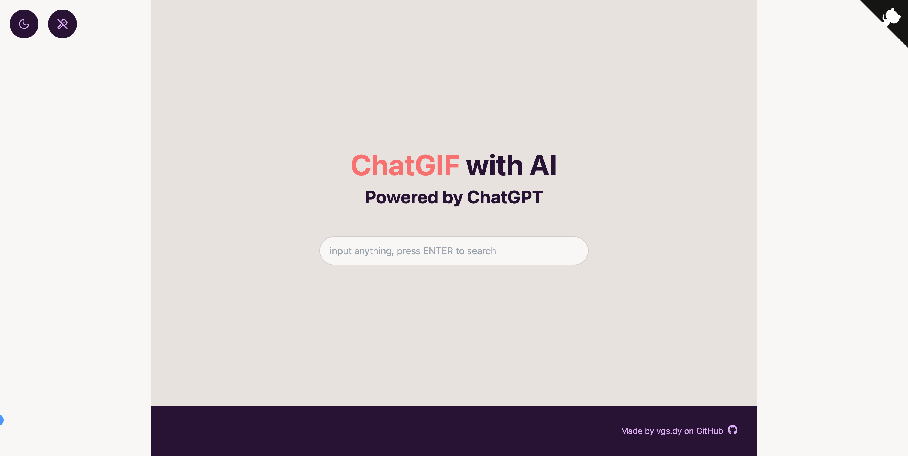
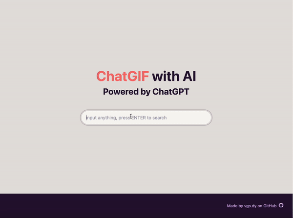

<h1 align="center">ChatGIF</h1>

使用ChatGPT协助你寻找有趣的gif图。

[演示 Demo](https://chatgif.vercel.app/) / [反馈 Issues](https://github.com/hellovigoss/chatgif/issues) 

## 主要功能

- 任意内容搜索gif图
- 支持 Vercel **免费一键部署**
- 支持自定义域名，**无障碍**快速访问

## Features

- search gif by any words
- **Deploy for free with one-click** on Vercel

## demo

## 使用

1. 准备好你的 [OpenAI API Key](https://platform.openai.com/account/api-keys);
2. 点击右侧按钮开始部署：
    
3. 部署完毕后，即可开始使用；
4. （可选）[绑定自定义域名](https://vercel.com/docs/concepts/projects/domains/add-a-domain)：Vercel 分配的域名 DNS 在某些区域被污染了，绑定自定义域名即可直连。

## Get Started

1. Get [OpenAI API Key](https://platform.openai.com/account/api-keys);
2. Click
    
3. Enjoy :)

你可以 star/watch 本项目或者 follow 作者来及时获得新功能更新通知。

You can star or watch this project or follow author to get release notifictions in time.

## 说明

本项目的演示地址所用的 OpenAI 账户的免费额度将于 2023-07-01 过期，届时将无法通过演示地址在线体验。

如果你想贡献出自己的 API Key，可以通过作者主页的邮箱发送给作者，并标注过期时间。

## Attention

The free trial of the OpenAI account used by the demo will expire on July 1, 2023, and the demo will not be available at that time.

If you would like to contribute your API key, you can email it to the author and indicate the expiration date of the API key.

## LICENSE

- [Anti 996 License](https://github.com/kattgu7/Anti-996-License/blob/master/LICENSE_CN_EN)